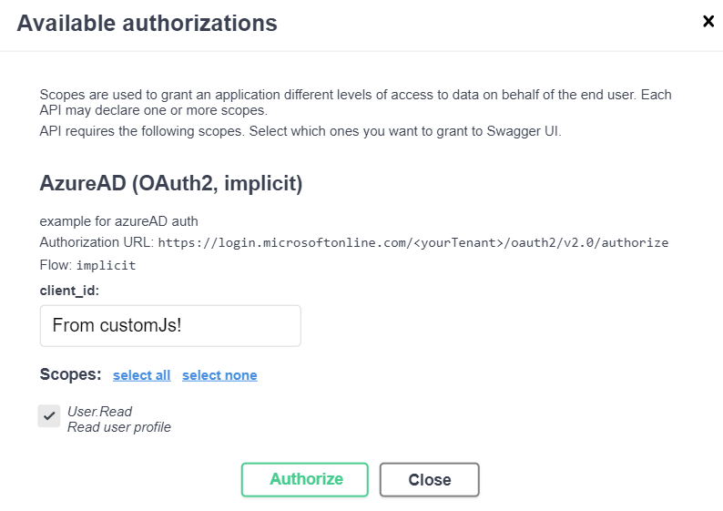

<p align="center">
  <a href="http://nestjs.com/" target="blank"></a>
</p>

[circleci-image]: https://img.shields.io/circleci/build/github/nestjs/nest/master?token=abc123def456
[circleci-url]: https://circleci.com/gh/nestjs/nest
</p>


## Description

[Nest](https://github.com/nestjs/nest) framework TypeScript starter repository.

This is an example on how to make use of swagger customJs option.

## Explanation

As of now, the swagger customJs option requires a path to a custom js file.

This is provided via the endpoint `http://localhost:3000/customJs`.

On Swagger UI loading, the path is called and the js file retrieved.

The js file waits for the window loading, listens to the `auth-wrapper` and executes a function once it is clicked and the popup opens.

## See working example

```bash
$ npm i
$ npm run start:dev
```
Open the [application](http://localhost:3000/swagger)

Clicking on the Authorize button will open a popup with the authorization code and already prefilled input fields.



---
## Support

Nest is an MIT-licensed open source project. It can grow thanks to the sponsors and support by the amazing backers. If you'd like to join them, please [read more here](https://docs.nestjs.com/support).

## Stay in touch

- Author - [Kamil Myśliwiec](https://kamilmysliwiec.com)
- Website - [https://nestjs.com](https://nestjs.com/)
- Twitter - [@nestframework](https://twitter.com/nestframework)

## License

Nest is [MIT licensed](LICENSE).
